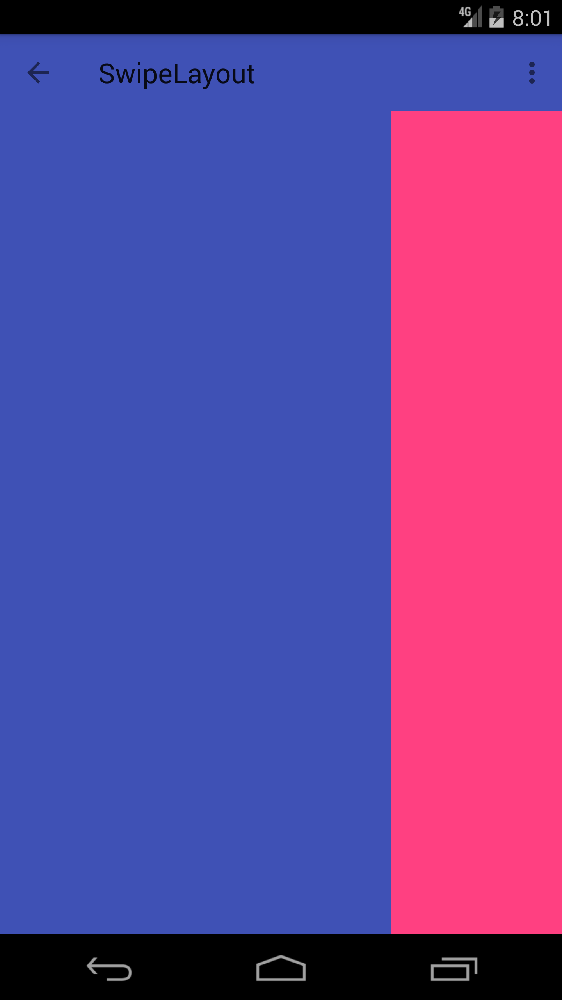

# SlideLayout  [](https://jitpack.io/#zpauly/SlideLayout)

一个灵活易用、可以帮助开发者实现侧滑效果的Android开源项目——SlideLayout。(什么，你想看英文的README？别急等两天哈)


# 使用

#### 1.依赖

**gradle:**

**Step 1.** 添加jitpack仓库

```groovy
	allprojects {
		repositories {
			...
			maven { url "https://jitpack.io" }
		}
	}
```

**Step 2.** 添加依赖

```groovy
	dependencies {
	        compile 'com.github.zpauly:SlideLayout:v1.0.0'
	}
```

**maven**

**Step 1.** 添加jitpack仓库

```xml
	<repositories>
		<repository>
		    <id>jitpack.io</id>
		    <url>https://jitpack.io</url>
		</repository>
	</repositories>
```

**Step 2.** 添加依赖

```xml
	<dependency>
	    <groupId>com.github.zpauly</groupId>
	    <artifactId>SlideLayout</artifactId>
	    <version>v1.0.0</version>
	</dependency>
```


#### 2.开始使用

**1.xml**

使用起来其实很简单，首先就是在你的layout文件中添加以下内容

```xml
<com.zpauly.swipeLayout.SlideLayout
    android:id="@+id/slide_layout"
    android:layout_width="match_parent"
    android:layout_height="match_parent">

  	<!--下层layout-->
    <include layout="@layout/behind_layout"/>

  	<!--上层layout-->
    <include layout="@layout/front_layout" />

</com.zpauly.swipeLayout.SlideLayout>
```

这里**SlideLayout**中的两个子**View**就是可提供用户滑动的**View**。值得注意的是越上层的**View**代码中的位置需要越靠下，另外**SlideLayout**默认只可以滑动最上层的**View**。

**SlideLayout**也提供了一些属性可以直接在布局文件中设置。

```xml
<com.zpauly.swipeLayout.SlideLayout
    app:enableSlide="true"
    app:enableSlideAuto="true"
    app:ratioOfAutoSlideDirectionChange="0.5"
    app:ratioOfBackToShow="1"
    app:ratioOfResistance="0"
    android:id="@+id/slide_layout"
    android:layout_width="match_parent"
    android:layout_height="match_parent">

  	······

</com.zpauly.swipeLayout.SlideLayout>
```

|              属性名称               |                   使用介绍                   |
| :-----------------------------: | :--------------------------------------: |
|        ratioOfResistance        | 设置滑动阻力。参数为一个范围为0-1的float类型的值，当为0时表示没有阻力，当为1时表示无法滑动。默认为0。 |
|        ratioOfBackToShow        | 设置可滑动的子View所能露出下层View的面积，即子View的滑动边界。参数为一个范围为0-1的float类型的值，表示所能滑动的范围与子View面积的比例。默认为1。 |
| ratioOfAutoSlideDirectionChange | 设置拖动操作后的惯性滑动方向会发生改变的位置，与下面的enableSlideAuto配合使用。参数为一个范围为0-1的float类型的值，表示改变惯性滑动的位置与可滑动子View所能滑动的范围的比例。当拖动子View为能达到这个位置的时候松开，子View会弹回起始位置，反之会弹到滑动边界。 |
|           enableSlide           | 设置SlideLayout中的子View是否能够滑动。参数为一个boolean类型值，true表示可以，为false时则不可以。默认为true。 |
|         enableSlideAuto         | 设置是否开启惯性滑动。参数为一个boolean类型的值，true表示开启，false则表示关闭。 |

**2.java**

然后如果你在你的**Activity**或**Fragment**中获得了**SlideLayout**对象，这里提供了下面的方法可供使用。

|                    方法                    |                   使用介绍                   |
| :--------------------------------------: | :--------------------------------------: |
|  void enableSlide(boolean enableSlide)   |             同上表中的enableSlide             |
|   void enableSlideAuto(boolean enable)   |           同上表中的enableSlideAuto           |
|  void setRatioOfResistance(float ratio)  |          同上表中的ratioOfResistance          |
|  void setRatioOfBackToShow(float ratio)  |          同上表中的ratioOfBackToShow          |
| void setRatioOfAutoSlideDirectionChange(float ratio) |   同上表中的ratioOfAutoSlideDirectionChange   |
| void setSlideDirection(SlideDirection direction) | 设置可滑动的方向。参数为一个枚举类型，包括SlideDirection.DIRECTION_LEFT(向左)、SlideDirection.DIRECTION_UP(向上)、SlideDirection.DIRECTION_RIGHT(向右)、SlideDirection.DIRECTION_DOWN(向下) |
|         boolean isEnableSlide()          |             获取enableSlide的值              |
|       boolean isEnableSlideAuto()        |           获取enableSlideAuto的值            |
|       float getRatioOfResistance()       |          获取ratioOfResistance的值           |
|       float getRatioOfBackToShow()       |          获取ratioOfBackToShow的值           |
| float getRatioOfAutoSlideDirectionChange() |   获取ratioOfAutoSlideDirectionChange的值    |
|    SlideDirection getSlideDirection()    |                 获取可滑动的方向                 |
|             void slideBack()             |             使子View自动滑动到起始位置              |
|           void slideForward()            |           使子View自动滑动到所设置的滑动边界            |
|        resetSlideView(int index)         | 重新设置可滑动的子View。参数为一个int类型的值，表示这个子View在SlideLayout中的索引值。 |
| boolean horizontalSmoothSlideTo(int left) | 如果滑动方向为SlideDirection.DIRECTION_LEFT或SlideDirection.DIRECTION_RIGHT时，可以将可滑动的子View在可滑动范围之内的滑动到指定位置。 |
|  boolean verticalSmoothSlideTo(int top)  | 如果滑动方向为SlideDirection.DIRECTION_UP或SlideDirection.DIRECTION_DOWN时，可以将可滑动的子View在可滑动范围之内的滑动到指定位置。 |

**3.callback**

这里还提供了一个回调用来监听滑动过程。

```java
public interface Callback {
    void onSliding(View slideView, int left, int top, int dx, int dy);

    void onSlideStateChanged(int newState);
}
```

使用

```java
mSlideLayout.setCallback(new SlideLayout.Callback() {
  	@Override
    public void onSliding(View slideView, int left, int top, int dx, int dy) {

    }

    @Override
    public void onSlideStateChanged(int newState) {

    }
});
```

#### 实现效果




# 最后

由于本人水平有限，如果你有什么意见或者发现有什么bug，欢迎issue或是给我发邮件，我在这里表示对大家的感谢。

邮箱：[zpauly1996@gmail.com](mailto:zpauly1996@gmail.com)


# License

```
Copyright 2016 zpauly

Licensed under the Apache License, Version 2.0 (the "License");
you may not use this file except in compliance with the License.
You may obtain a copy of the License at

   http://www.apache.org/licenses/LICENSE-2.0

Unless required by applicable law or agreed to in writing, software
distributed under the License is distributed on an "AS IS" BASIS,
WITHOUT WARRANTIES OR CONDITIONS OF ANY KIND, either express or implied.
See the License for the specific language governing permissions and
limitations under the License.
```
